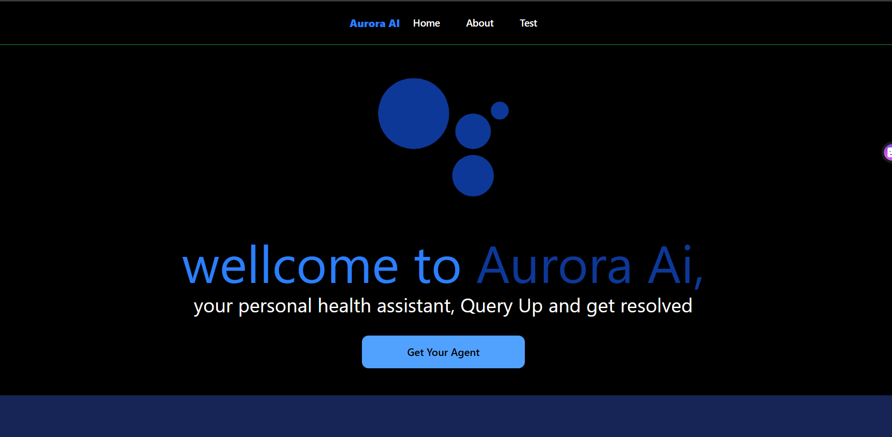
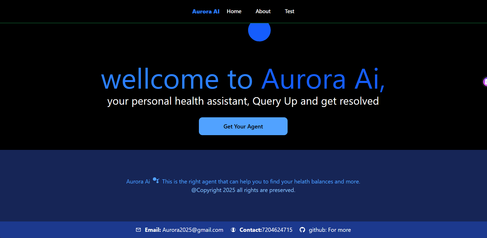
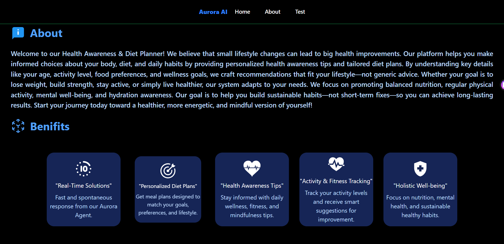
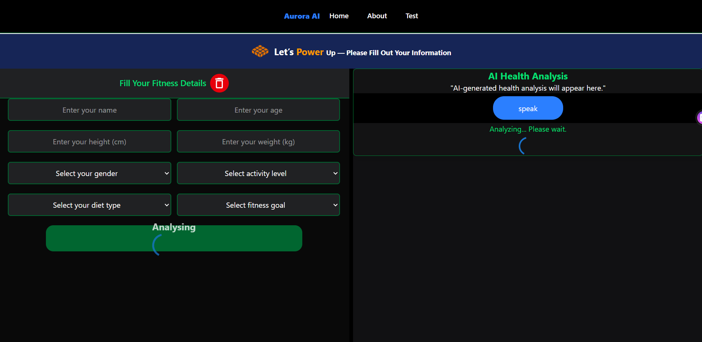
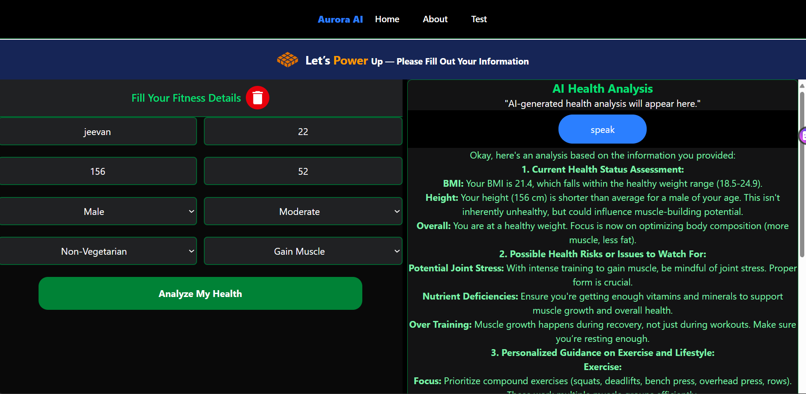

# 🌌 Aurora — AI Health Suggestion System

**Aurora** is a smart **AI-powered Health Awareness & Diet Planner** built using **React + Vite**, **Tailwind CSS**, **Material UI**, and **Google Gemini API**.  
It analyzes user data like **name, age, gender, height, weight, diet, activity level, and fitness goal** to generate **personalized health insights, meal plans, and fitness recommendations** — all through AI.

---

## 🚀 Overview

The **Aurora Health App** provides:

* AI-driven personalized diet and fitness analysis.  
* Real-time suggestions for body health and wellness.  
* Multiple sections — Home, About, Testing, Result, and Footer.  
* Beautiful responsive design using **Tailwind CSS** and **Material UI**.  
* Animated loader and seamless transition effects.  
* Smart Gemini AI integration for accurate health guidance.  

---

## 🧠 Features

✅ **Real-time AI Analysis** — Gemini-powered instant health insights.  
✅ **Custom Diet & Fitness Plans** — Based on user’s fitness goals.  
✅ **Holistic Suggestions** — Focus on body, nutrition, and mind.  
✅ **Smooth Loader & Transitions** — Enhanced user experience.  
✅ **Multi-Page Interface** — Organized navigation and content.  
✅ **Modern UI** — Styled with Tailwind CSS + Material UI components.  

---

## 🛠️ Tech Stack

| Technology          | Purpose                                        |
| -------------------- | ---------------------------------------------- |
| ⚛️ **React + Vite**  | High-performance frontend framework            |
| 🎨 **Tailwind CSS**  | Responsive, utility-first styling framework    |
| 🧩 **Material UI (MUI)** | Sleek and consistent React UI components   |
| 🤖 **Google Gemini API** | AI model for health & diet recommendations |
| 💬 **React Markdown** | Formats AI responses neatly for readability   |
| 🪶 **React Icons**   | Adds modern and clean icons to the interface   |

---

## 📸 Screenshots

| Section                     | Preview                                              |
| ---------------------------- | ---------------------------------------------------- |
| 🏠 Home Page                 |           |
| ℹ️ About Page                |         |
| 🧪 Testing Page              |     |
| ⏳ Loader Animation          |  |
| 🧠 Result Page               |       |

---

## ⚙️ Installation & Setup

1. **Clone the repository**
   ```bash
   git clone https://github.com/yourusername/aurora.git
